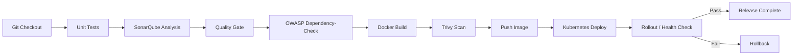

# DevSecOps Jenkins Pipeline

[](https://github.com/pranay9-h/devsecops-jenkins-pipeline/actions/workflows/validate.yml)

Jenkins-based DevSecOps pipeline with unit tests, SonarQube quality gates, OWASP dependency scanning, Trivy image scanning, Kubernetes deployment checks, and rollback.

> **Portfolio safety:** this repository contains no real credentials. A live run requires your own Jenkins, SonarQube, container registry credentials, Kubernetes/EKS cluster, and configured Jenkins plugins/tools.

## Pipeline architecture



See [docs/pipeline-flow.md](docs/pipeline-flow.md) for gate behavior and credential expectations.

## What this demonstrates

- Jenkins declarative pipeline structure
- build gating before deployment
- Python unit testing with pytest
- SonarQube static analysis and quality gates
- OWASP Dependency-Check integration
- Trivy container vulnerability scanning
- non-root Docker image
- immutable build-number image tags
- Kubernetes rolling deployment
- readiness and liveness probes
- resource requests and limits
- post-deployment validation
- automated Kubernetes rollback
- credentials stored in Jenkins rather than source control

## Repository structure

```text
.
├── .github/
│   └── workflows/
│       └── validate.yml
├── app/
│   ├── app.py
│   ├── requirements.txt
│   ├── requirements-dev.txt
│   └── test_app.py
├── docs/
│   └── pipeline-flow.md
├── kubernetes/
│   ├── deployment.yaml
│   ├── namespace.yaml
│   └── service.yaml
├── scripts/
│   ├── health-check.sh
│   └── rollback.sh
├── .gitignore
├── Dockerfile
├── Jenkinsfile
├── README.md
├── SECURITY.md
└── sonar-project.properties
```

## Sample application

The included Flask API provides:

- `/` for service metadata
- `/health` for container and Kubernetes health checks

Run locally:

```bash
python3 -m venv .venv
. .venv/bin/activate
pip install -r app/requirements.txt -r app/requirements-dev.txt
cd app
pytest -q
python app.py
```

## Container build

```bash
docker build -t devsecops-sample-app:local .
docker run --rm -p 8080:8080 devsecops-sample-app:local
curl http://localhost:8080/health
```

The container:

- runs as a non-root user
- exposes port 8080
- includes a Docker health check
- avoids storing credentials in the image

## Jenkins prerequisites

The pipeline assumes the Jenkins controller/agent has access to:

- Python 3
- Docker CLI and daemon
- SonarScanner CLI
- Trivy
- kubectl
- Jenkins SonarQube plugin
- Jenkins OWASP Dependency-Check plugin
- Workspace Cleanup plugin

It also assumes Jenkins is configured with a SonarQube installation named:

```text
sonarqube
```

and a Dependency-Check installation named:

```text
dependency-check
```

## Jenkins credentials

Create these in **Jenkins Credentials**, not in Git:

| Credential ID | Type | Purpose |
|---|---|---|
| `container-registry` | Username/Password | Push image to GHCR |
| `eks-kubeconfig` | Secret file | Demo Kubernetes cluster access |

For a production AWS/EKS pipeline, prefer short-lived AWS identity and generated kubeconfig over a long-lived kubeconfig file.

## SonarQube quality gate

The Jenkins pipeline runs:

1. SonarQube analysis
2. `waitForQualityGate`
3. pipeline abort if the configured quality gate fails

That prevents deployment stages from running when the code does not meet the configured quality policy.

## Dependency security

### OWASP Dependency-Check

The pipeline runs OWASP Dependency-Check against the application dependency set and publishes the generated report.

For real CI at scale, configure an NVD API key in Jenkins to reduce update throttling.

### Trivy

Container images are scanned before registry push:

```bash
trivy image --exit-code 1 --severity HIGH,CRITICAL --ignore-unfixed <image>
```

This blocks images with fixable HIGH or CRITICAL findings.

## Kubernetes deployment

The manifests demonstrate:

- namespace isolation
- two replicas
- rolling updates
- `maxUnavailable: 0`
- readiness and liveness probes
- non-root execution
- RuntimeDefault seccomp
- privilege escalation disabled
- dropped Linux capabilities
- read-only root filesystem
- CPU/memory requests and limits

The pipeline deploys manifests and then updates the Deployment to the immutable Jenkins build-number image tag.

## Health validation

`scripts/health-check.sh` first waits for:

```bash
kubectl rollout status
```

An optional `HEALTH_URL` can be supplied when the application has a reachable endpoint outside the cluster.

If no URL is supplied, successful rollout readiness is the deployment health gate.

## Rollback

If deployment or deployment validation fails, the Jenkins post-failure path calls:

```bash
kubectl rollout undo deployment/sample-api
kubectl rollout status deployment/sample-api
```

This demonstrates the same operational pattern expected in production release pipelines: detect failure, restore the previous ReplicaSet, then verify the rollback.

## GitHub validation

GitHub Actions validates the repository independently of Jenkins by running:

- unit tests
- Docker build
- shell syntax validation

This workflow does not deploy anything and does not require cloud credentials.

## Security

See [SECURITY.md](SECURITY.md).

Never commit:

- AWS credentials
- registry tokens
- SonarQube tokens
- kubeconfig files
- private keys
- Kubernetes secrets containing real values

## Suggested production improvements

This portfolio deliberately stays understandable enough to discuss line-by-line in an interview. A production implementation could additionally include:

- short-lived AWS authentication using workload identity
- GitOps deployment instead of direct `kubectl`
- signed container images and provenance
- policy-as-code
- SBOM generation
- external secret management
- separate promotion stages for dev/stage/prod
- approval gates for production
- centralized audit logging and notifications

## Interview discussion points

Be prepared to explain:

- why quality gates run before deployment
- SAST vs dependency scanning vs container scanning
- what causes Trivy to fail the pipeline
- why immutable image tags are preferred over `latest`
- readiness vs liveness probes
- how Kubernetes rollout history enables rollback
- why credentials belong in Jenkins Credentials
- how to avoid long-lived kubeconfig credentials for EKS
- what you would change for production promotion and GitOps

## Author

Pranay Saiteja Soppadandi  
GitHub: https://github.com/pranay9-h  
LinkedIn: https://www.linkedin.com/in/pranay-sai-teja-2b257b1a1/
