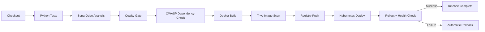

# DevSecOps Pipeline Flow

## Gate behavior

- Unit-test failure stops the pipeline.
- SonarQube quality-gate failure stops the pipeline before image publication.
- OWASP Dependency-Check is configured as a dependency-security gate.
- Trivy blocks images containing HIGH or CRITICAL vulnerabilities.
- Kubernetes rollout status acts as the first deployment health gate.
- An optional HTTP health URL can be checked after rollout.
- A failed deployment or health check triggers `kubectl rollout undo`.

## Credential model

The Jenkinsfile expects credentials to be stored in Jenkins Credentials rather than source control:

- `container-registry`: username/password or username/token for the container registry.
- `eks-kubeconfig`: kubeconfig file credential for the demonstration cluster.
- `nvd-api-key`: optional secret text for faster OWASP Dependency-Check NVD updates.

SonarQube authentication is expected to be managed by the Jenkins SonarQube integration.
